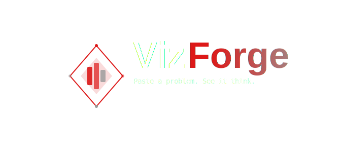

# VizForge 🔮 v1.0.0

## Inspiration

I built VizForge because I wanted to actually *see* algorithm and problem descriptions work, not just read about them. 
Most DSA resources explain what an algorithm does, but watching it step through your specific 
problem is a completely different experience. That gap is what VizForge tries to fill.

## What it does

VizForge takes a LeetCode-style problem, sends it to an AI, and generates a step-by-step 
visual breakdown of how the algorithm solves it (arrays, pointers, highlights, and all).

## Tech Stack

- **Next.js + TypeScript** — frontend & API routes
- **Tailwind CSS** — styling
- **Groq (llama-3.3-70b-versatile)** — AI backbone
- **Framer Motion** — animations

## ⚠️ Work in Progress

This project is still actively being built. Here's the honest state of things:

- Only **array** visualizations are fully implemented so far
- The AI sometimes produces inconsistent steps — this is a limitation of the model being used (Free tier Groq lol)
- A stronger model would yield significantly better results (Claude subscription :D), the visualizations would be 
  significantly more accurate and consistent
- More data structure visualizers are planned (linked lists, trees, graphs, stacks, DP)

## A note on originality (Honest)

This is an original idea I came up with and built from scratch. Every design decision, 
architecture choice, and line of code reflects my own learning process as a developer. The framer motion is the only
one that's really vibe coded because I need assistance on it. I'm also currently learning framer motion right now so yea.
I won't deny SOME of the design like coloring and lighting/shadows are also AI assisted :D!

## Author

**Daniel** — 2nd year CS student, Visayas State University